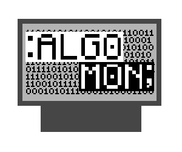
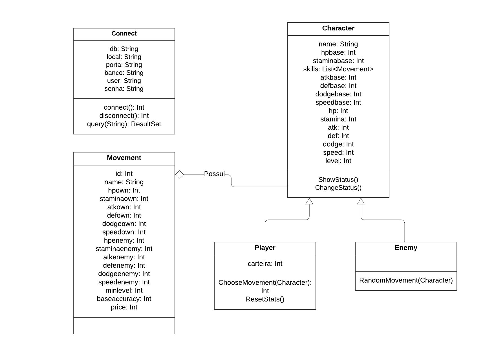
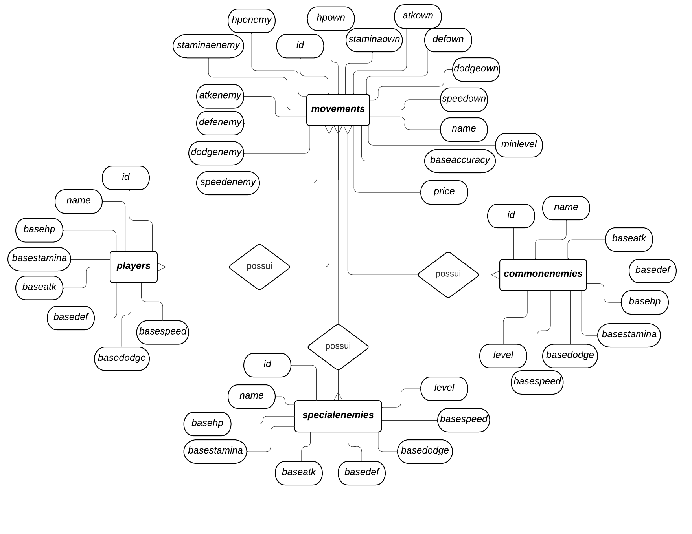

# Algomon

## Descrição do Projeto
Neste projeto será desenvolvido um jogo eletrônico de batalha em turnos. O projeto faz parte do desenvolvimento do curso MAC0350 - Introdução ao Desenvolvimento de Sistemas de Software, oferecido pelo professor Paulo Roberto Miranda Meirelles no Instituto de Matemática e Estatística da Universidade de São Paulo (IME-USP).

## História do Jogo
A história do jogo acontece em um campeonato de programadores que ocorre na cidade na qual a personagem principal (jogador) se residencia. Devido ao sonho de se tornar um programador experiente, mesmo sendo um iniciante, o personagem principal se inscreve e torna-se um competidor do campeonato. O campeonato é dividido em várias fases, na qual cada fase o jogador deve enfrentar os outros competidores batalhando com código. Durante o período da competição o personagem principal vai se aprimorando as suas habilidades de programação, adquirir conhecimentos sobre diferentes algoritmos e teorias, e por fim derrota todos os inimigos e torna o vencedor do campeonato.

## Características do Jogo
A mecânica do jogo será semelhante ao mecâncica do famoso jogo Pokemon, porém os ataques do jogo serão os algoritmos ou técnicas de programação existentes de verdade. 
Entre o intervalo de cada competição, o jogodor terá um tempo livre que é utilizado para aperfeiçoar as habilidades da personagem principal, tais como aprender os algoritmos e teorias através da internet, passear no ambiente da competição conhecendo os outros competidores, ou treinar suas técnicas próprias de programação.,

## Linguagens de Programação utilizada
o projeto será desenvolvido em linguagem Kotlin baseado no framework libGDX. Como IDE foi utilizado o Android Studio, que é focado em desenvolvimento para Android e já possui recursos para esse sistema.

## SGBD utilizado
Nosso projeto se utiliza do SGBD PostgreSQL para organizar os dados a serem utilizados no programa.

## Cliente-servidor
A requisição de dados do banco de dados é feita por meio de uma rede cliente-servidor implementada por meio do framework Ktor.

## Testes
Os testes automatizados foram realizados com o framework JUnit, que pode ser utilizado em linguagens compatíveis com a JVM, como é o caso de Kotlin.

## Diagramas

Diagrama UML do projeto

Diagrama ER do banco de dados

## Execução

Execução do jogo (gráfico): 
Execute o main do arquivo Lwjgl3Launcher.kt, localizado no diretório lwgl3.

Execução do jogo (linha de comando):
Execute o main do arquivo game.kt localizado no diretório core.

Execução do servidor:
O servidor é iniciado por meio do main do arquivo server.kt, também esse no diretório core.

Execução dos testes:
Vá aos arquivos de testes e execute a partir das indicações nas linhas de código.

## Autores e Contribuidores
Fernando Yang: Programador e Designer do Projeto
Lucas Eiji: Programador e Designer do Projeto
Paulo Roberto Miranda Meirelles: Orientador do Projeto

## License
A licença (GNU General Public License v3.0) pode ser verificada no arquivo LICENSE.
